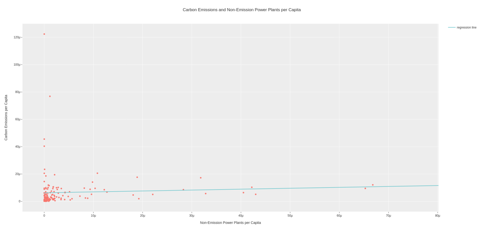
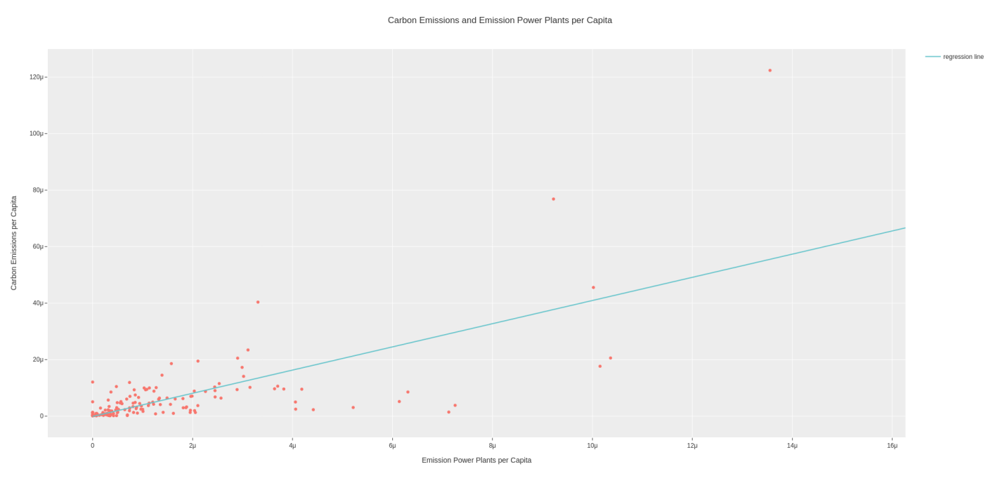
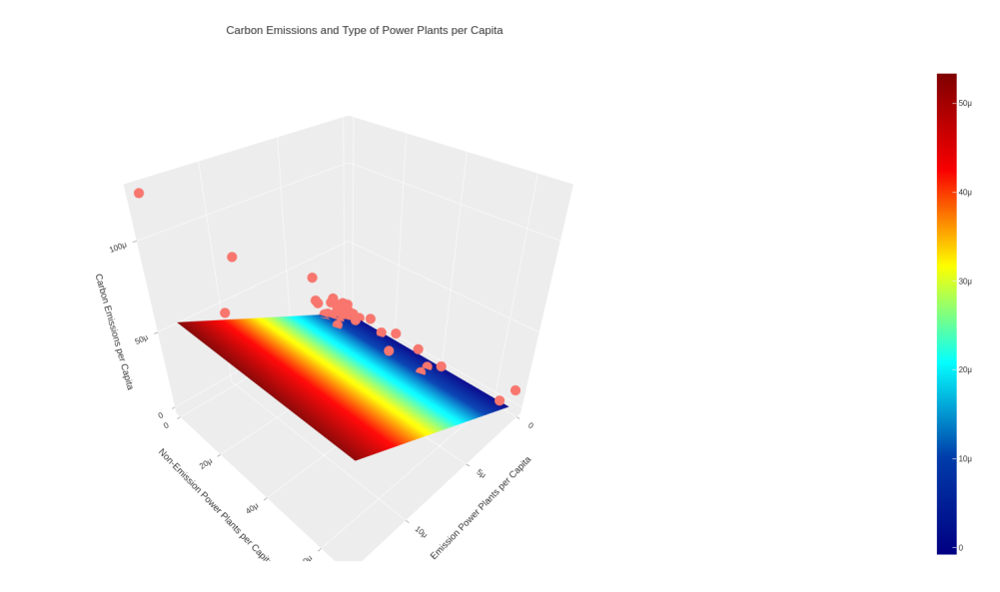
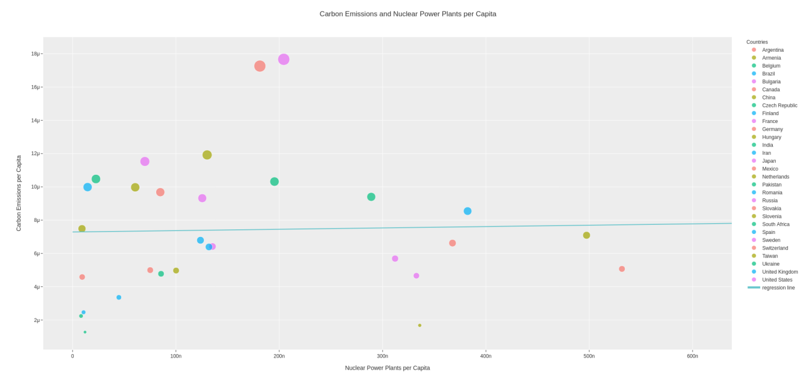
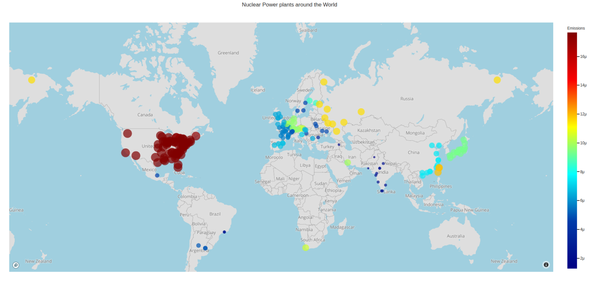

# Data Analysis and Linear Regressions

<!-- TABLE OF CONTENTS -->

  
Table of Contents

  <ol>
    <li>
      <a href="#about-the-project">About The Project</a>
      <ul>
        <li><a href="#built-with">Built With</a></li>
        <li><a href="#data">Data</a></li>
      </ul>
    </li>
    <li><a href="#visulizations">Visulizations</a></li>
    <li><a href="#contributers">Contributers</a></li>
  </ol>

<!-- ABOUT THE PROJECT -->
## About The Project
The United Nations has recognized climate change to be an imminent threat to humankind.  In response, the Paris Agreement, signed in 2015 by a total of 197 countries around the world aims to limit the global temperature rise below 2 degree celsius,  while aiming to limit the increase under 1.5 degree celsius. Naturally, a large focus of these efforts is on the global energy sector, as 25% of 2010 global greenhouse gas emissions were a result of electricity and heat production.
We used current powerplant and carbon emission data to predict how the number of emission and non-emission powerplants in a country impact their carbon emissions. The research question we explored is, **“How does the number of Emissions and Non-Emissions powerplants per capita in a country predict their Carbon Emissions per capita?"**
We implemented two different regression methods, using the NumPy python library and trained them on 20% of the data and computed the average error and comparing that to the scikit-learn python library implementation of linear regression, then used our implementations to make predictions based on our coefficients.  

For more information, references and analysis, see [Project Report.pdf](https://github.com/hashimr1/Data-Analysis-and-Linear-Regressions/blob/main/Project%20Report.pdf) 

### Built With

* [Python](https://www.python.org/)
* [Plotly](https://plotly.com/)
* [scikit-learn](https://scikit-learn.org/)
* [pandas](https://pandas.pydata.org/)
* [NumPy](https://numpy.org/)

### Data
* [CO₂ and Greenhouse Gas Emissions](https://ourworldindata.org/co2-and-other-greenhouse-gas-emissions)
* [Global Power Plant Database](https://datasets.wri.org/dataset/globalpowerplantdatabase)
* [Countries of the World](https://www.kaggle.com/datasets/fernandol/countries-of-the-world)

Raw data from 3 different data sets (countries of the world.csv, global_power_plant_database.csv, owid-co2-data.csv) containing data about population, carbon emissions and powerplants for most countries around the world, was processed from the csv files into nested lists. 

(<a href="#top">back to top</a>)

## Visulizations
Visualizations of the data were done using the Plotly (plotly.express and plotly.graphobjects) and Pandas python libraries.  Data in the form of lists were converted to Pandas Data Frames objects. Data and lines of best fit that were computed were visualized using plotly functions.

(<a href="#top">back to top</a>)

<!-- CONTRIBUTERS -->
## Contributers
- Raazia Hashim
- Shilin Zhang
- Kenneth Miura

 [CSC110 - Foundations of Computer Science I](https://artsci.calendar.utoronto.ca/course/csc110y1)

(<a href="#top">back to top</a>)

